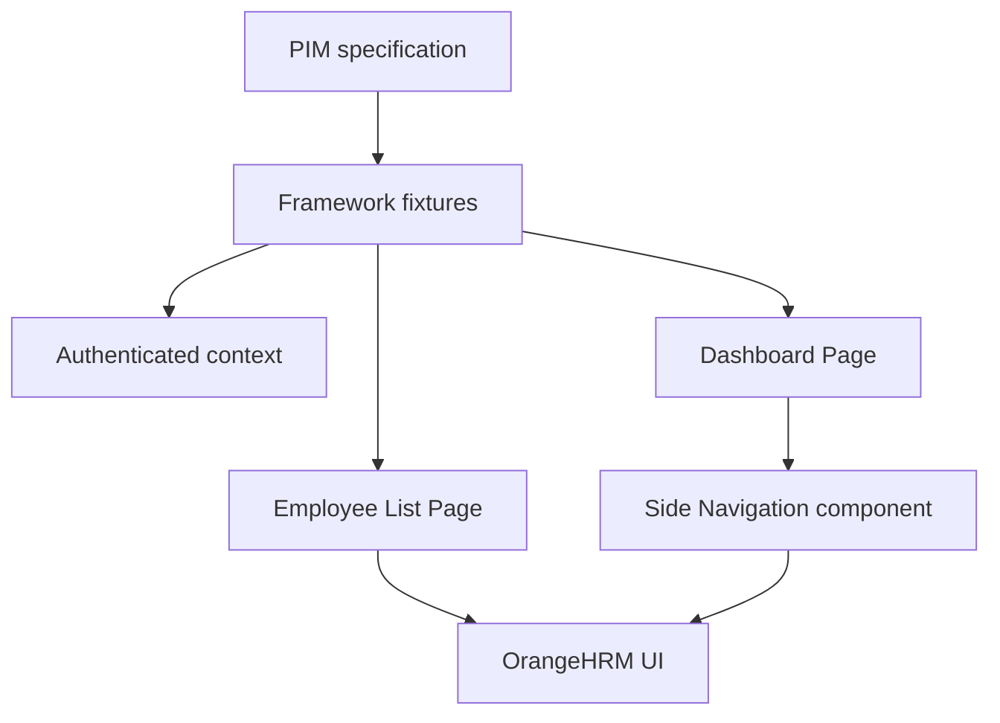

# Step-by-step usage and exploration guide

This guide takes you from a clean machine to running, debugging, extending, and operating the
framework in CI. Run commands from the project root—the directory containing `package.json` and
`playwright.config.ts`.

## 1. Understand what the framework covers

The included tests demonstrate business and framework-level patterns:

| Capability   | Specification                           | What it demonstrates                            |
| ------------ | --------------------------------------- | ----------------------------------------------- |
| Health check | `tests/api/health.spec.ts`              | Browser-independent HTTP testing                |
| Login        | `tests/e2e/auth/login.spec.ts`          | Positive and negative unauthenticated UI tests  |
| Dashboard    | `tests/e2e/dashboard/dashboard.spec.ts` | Reusing authenticated browser state             |
| PIM          | `tests/e2e/pim/employee-list.spec.ts`   | Page navigation and read-only employee results  |
| Feature lab  | `tests/features/*.spec.ts`              | Dialogs, frames, storage, events and UI actions |
| Mock API     | `tests/api/mock-api.spec.ts`            | Parallel CRUD, auth, query and error testing    |

Playwright expands the four UI cases across Chromium, Firefox, and WebKit. An authentication setup
project creates browser state before authenticated UI tests, while the API project stays independent
of browsers.

## 2. Install the prerequisites

Install:

- Node.js 22 or later
- npm 10 or later
- Git, if the project will be version controlled
- VS Code with the official **Playwright Test for VS Code** extension, recommended but optional

Verify Node and npm:

```bash
node --version
npm --version
```

The versions should satisfy the `engines` section of `package.json`. Using a Node version manager
such as `nvm`, `fnm`, or Volta makes the version consistent across a team.

## 3. Extract and open the project

Extract `orangehrm-playwright-framework.zip`, open a terminal, and enter the extracted folder:

```bash
cd orangehrm-playwright-framework
```

Confirm that you are in the correct location:

```bash
npm pkg get name
```

It should return `orangehrm-playwright-enterprise-framework`.

## 4. Install project dependencies

Use the checked-in lock file for reproducible installation:

```bash
npm ci
```

Use `npm ci` on developer machines and CI agents. Use `npm install <package>` only when intentionally
adding or upgrading a dependency; review and commit both `package.json` and `package-lock.json`.

## 5. Install Playwright browsers

Install Chromium, Firefox, WebKit, and the required operating-system libraries:

```bash
npx playwright install --with-deps
```

On Windows or macOS, where the OS dependencies are already managed, this is usually sufficient:

```bash
npx playwright install
```

To install only Chromium for an initial run:

```bash
npx playwright install chromium
```

If a corporate proxy blocks browser downloads, configure the proxy before installation or use the
pinned Playwright Docker image described later in this guide.

## 6. Create the local environment file

macOS, Linux, or Git Bash:

```bash
cp .env.example .env
```

Windows PowerShell:

```powershell
Copy-Item .env.example .env
```

The example contains the OrangeHRM public-demo values:

```dotenv
TEST_ENV=demo
BASE_URL=https://opensource-demo.orangehrmlive.com
TEST_USERNAME=Admin
TEST_PASSWORD=admin123
HEADLESS=true
WORKERS=4
RETRIES=1
```

The `.env` file is ignored by Git. Never remove it from `.gitignore`, even when an account is only a
demo account.

### Environment resolution

The framework loads configuration in this order, with later files taking precedence:

1. `.env`
2. `.env.<TEST_ENV>`, for example `.env.qa`
3. `.env.local`
4. Values injected by the shell or CI environment

Example for a QA environment:

```dotenv
# .env.qa
BASE_URL=https://qa.example.com
TEST_USERNAME=qa-automation
TEST_PASSWORD=replace-through-secret-management
WORKERS=8
RETRIES=2
```

Run it by setting `TEST_ENV=qa` in `.env` or in the shell. Configuration is parsed by Zod in
`src/config/env.ts`; invalid URLs and numeric values fail immediately. Credentials are required only
when the authenticated OrangeHRM setup project runs, so API and feature-lab projects stay independent.

## 7. Run the first checks

Start with the browser-independent health test:

```bash
npm run test:api
```

Run deterministic browser-feature coverage without OrangeHRM credentials:

```bash
npm run test:features
```

Then run the Chromium smoke suite:

```bash
npx playwright test --project=chromium --grep @smoke
```

Finally, run the complete cross-browser suite:

```bash
npm test
```

A normal run creates:

- `playwright-report/` for the HTML report
- `test-results/` for screenshots, traces, videos, and error context
- `.auth/admin.json` for temporary authenticated browser state

All three paths are ignored by Git.

## 8. Choose exactly what to run

### By browser

```bash
npm run test:chromium
npm run test:firefox
npm run test:webkit
```

### By tag

```bash
npm run test:smoke
npm run test:regression
npx playwright test --grep @pim
npx playwright test --grep @auth
```

Run tests that have both tags:

```bash
npx playwright test --grep "(?=.*@smoke)(?=.*@auth)"
```

Exclude a tag:

```bash
npx playwright test --grep-invert @regression
```

### By file, folder, or test title

```bash
npx playwright test tests/e2e/auth/login.spec.ts --project=chromium
npx playwright test tests/e2e/pim --project=chromium
npx playwright test --project=chromium --grep "invalid credentials"
```

### List without executing

```bash
npx playwright test --list
```

This is valuable when checking project selection, tags, and test discovery.

## 9. Run headed, interactive, or debug modes

Show the browser while tests execute:

```bash
npm run test:headed -- --project=chromium
```

Open Playwright's interactive test explorer:

```bash
npm run test:ui
```

Run with the Playwright Inspector, pausing before each action:

```bash
npm run test:debug -- --project=chromium
```

Debug one test more quickly:

```bash
npx playwright test tests/e2e/auth/login.spec.ts \
  --project=chromium \
  --grep "invalid credentials" \
  --debug
```

PowerShell uses a backtick instead of a backslash for multiline commands, or the command can be
entered on one line.

You can temporarily add `await page.pause()` while debugging locally. Remove it before committing;
CI will reject committed `test.only`, and code review should reject debugging pauses.

## 10. Read reports and failure evidence

Open the most recent HTML report:

```bash
npm run report
```

The configuration captures:

| Evidence       | Capture policy              |
| -------------- | --------------------------- |
| Screenshot     | Only when a test fails      |
| Video          | Retained when a test fails  |
| Trace          | Captured on the first retry |
| HTML report    | Every local and CI run      |
| JUnit and JSON | CI runs                     |

Open a trace:

```bash
npx playwright show-trace test-results/path-to-trace.zip
```

The trace viewer contains the action timeline, DOM snapshots, locators, console output, network
activity, metadata, and source steps. Check the action before the failure first; it commonly reveals
whether the defect is a locator problem, slow application state, bad data, or a genuine product bug.

Remove generated evidence and authentication state:

```bash
npm run clean
```

## 11. Explore the project from top to bottom

```text
orangehrm-playwright-framework/
├── .github/workflows/       GitHub CI and release-image workflows
├── docs/                    Usage and architecture documentation
├── src/
│   ├── api/                 HTTP clients
│   ├── components/          Reusable UI regions
│   ├── config/              Typed environment configuration
│   ├── core/                Base Page Object behavior
│   ├── fixtures/            Object construction and context lifecycle
│   ├── models/              TypeScript domain contracts
│   ├── pages/               OrangeHRM Page Objects
│   └── utils/               Data and logging helpers
├── tests/
│   ├── api/                 Browser-independent API specifications
│   ├── e2e/                 UI specifications by business capability
│   └── setup/               Authentication setup project
├── playwright.config.ts     Projects, reporters, retries, evidence, timeouts
├── eslint.config.mjs        Static-quality rules
├── Dockerfile               Reproducible runner image
├── docker-compose.yml       Local container execution
├── Jenkinsfile              Parallel Jenkins pipeline
└── package.json             Commands and pinned tools
```

Follow one test through the layers:



1. `employee-list.spec.ts` describes the business behavior.
2. `testFixtures.ts` supplies the page and Page Objects.
3. `auth.setup.ts` previously saved a valid authenticated state.
4. `DashboardPage` delegates repeated navigation behavior to `SideNavigation`.
5. `EmployeeListPage` owns the PIM locators and expected page state.
6. Playwright records evidence and reports the result.

## 12. Understand Page Objects and components

`BasePage` contains behavior shared by complete pages, such as navigation, application readiness,
and URL verification. A page extends it:

```ts
export class DashboardPage extends BasePage {
  readonly heading: Locator;

  constructor(page: Page) {
    super(page);
    this.heading = page.getByRole('heading', { name: 'Dashboard' });
  }

  async expectLoaded(): Promise<void> {
    await expect(this.heading).toBeVisible();
    await this.verifyUrl(/\/dashboard\/index$/);
  }
}
```

Components represent UI regions that appear on multiple pages. `SideNavigation` and `UserMenu` are
components, so their locators and behavior are not duplicated across Page Objects.

Use this locator priority:

1. User-facing role, label, placeholder, or text
2. A product-owned `data-testid`
3. A CSS selector scoped inside a Page Object or component

Avoid XPath, fixed waits, long `nth()` chains, and generated classes when a semantic locator exists.

## 13. Understand fixtures and authentication

`src/fixtures/testFixtures.ts` extends Playwright's base test. It injects:

- `loginPage` using an unauthenticated page
- `authenticatedPage` using fresh context plus saved storage state
- `dashboardPage` and `employeeListPage` using that authenticated page
- `apiClient` using Playwright's request context

The setup project performs one UI login and saves `.auth/admin.json`. Every browser project declares
`dependencies: ['setup']`, so authenticated state exists before business tests run.

Each business test still receives a fresh browser context. Cookies are initialized from the same
state, but browser-side mutations, local storage changes, and open pages remain isolated.

Do not commit `.auth/admin.json`: it contains a valid session and should be treated as a secret.

## 14. Understand parallel execution

`fullyParallel: true` allows independent test files and tests to use multiple workers. The worker
count comes from `WORKERS`; when omitted, Playwright chooses an appropriate local default.

Override it for one run:

```bash
npx playwright test --workers=2
```

Run serially when diagnosing a race or shared-data problem:

```bash
npx playwright test --workers=1
```

Divide a suite across four agents:

```bash
npx playwright test --project=chromium --shard=1/4
npx playwright test --project=chromium --shard=2/4
npx playwright test --project=chromium --shard=3/4
npx playwright test --project=chromium --shard=4/4
```

Parallel-safe test rules:

- Never require one test to run before another.
- Generate unique data with `uniqueValue()`.
- Allocate independent accounts when tests mutate server-side state.
- Clean up created data in a fixture or `try/finally` block.
- Never use a shared record that another parallel test updates or deletes.
- Keep the public OrangeHRM demo tests read-only.

## 15. Understand retries and timeouts

Values come from `.env`:

```dotenv
RETRIES=1
ACTION_TIMEOUT_MS=15000
NAVIGATION_TIMEOUT_MS=30000
TEST_TIMEOUT_MS=60000
EXPECT_TIMEOUT_MS=10000
```

An assertion such as `await expect(locator).toBeVisible()` retries until `EXPECT_TIMEOUT_MS` expires.
Do not add `waitForTimeout()` to hide a synchronization issue. Wait for a user-visible element,
network response, URL, loading completion, or domain state instead.

Retries gather diagnostic evidence; they are not a substitute for fixing flaky tests. Treat a test
that passes only on retry as a quality problem.

## 16. Add a new Page Object and test

Example: add a Leave page.

Create `src/pages/LeavePage.ts`:

```ts
import { expect, type Locator, type Page } from '@playwright/test';

import { BasePage } from '../core/BasePage.js';

export class LeavePage extends BasePage {
  readonly heading: Locator;

  constructor(page: Page) {
    super(page);
    this.heading = page.getByRole('heading', { name: 'Leave List' });
  }

  async expectLoaded(): Promise<void> {
    await expect(this.heading).toBeVisible();
    await this.verifyUrl(/\/leave\/viewLeaveList$/);
  }
}
```

Add it to `FrameworkFixtures` in `src/fixtures/testFixtures.ts`, import it, and construct it with
`authenticatedPage`, following the existing `EmployeeListPage` fixture.

Create `tests/e2e/leave/leave-list.spec.ts`:

```ts
import { test } from '../../../src/fixtures/testFixtures.js';

test.describe('Leave list', { tag: ['@regression', '@leave'] }, () => {
  test('administrator can open the leave list', async ({ authenticatedPage, leavePage }) => {
    await authenticatedPage.goto('/web/index.php/leave/viewLeaveList');
    await leavePage.expectLoaded();
  });
});
```

Then run:

```bash
npm run validate
npx playwright test tests/e2e/leave --project=chromium
```

## 17. Add an API test

Extend `ApiClient` when an endpoint is reused or has a domain-specific contract. Keep raw endpoint
paths and authentication headers out of specifications where possible.

Example specification:

```ts
import { test, expect } from '../../src/fixtures/testFixtures.js';

test('application endpoint returns HTML', { tag: '@api' }, async ({ apiClient }) => {
  const response = await apiClient.get('/web/index.php/auth/login');
  expect(response.headers()['content-type']).toContain('text/html');
});
```

Run API tests without installing a browser:

```bash
npm run test:api
```

For authenticated OrangeHRM APIs, build a domain client that obtains and refreshes its token or
session through a fixture. Never hard-code tokens in tests.

## 18. Run all quality gates before committing

```bash
npm run validate
```

This runs:

1. Strict TypeScript compilation without emitting JavaScript
2. ESLint with TypeScript type information and Playwright rules
3. Prettier verification
4. Playwright test discovery

Automatically format files:

```bash
npm run format
```

Automatically repair safe lint violations:

```bash
npm run lint:fix
```

Recommended local pull-request check:

```bash
npm run validate
npx playwright test --project=chromium --grep @smoke
```

## 19. Use GitHub Actions CI/CD

The workflow `.github/workflows/tests.yml` runs on pull requests, pushes to `main` or `develop`, a
weekday schedule, and manual dispatch.

Repository setup:

1. Push the project to GitHub.
2. Open **Settings → Secrets and variables → Actions**.
3. Create `ORANGEHRM_USERNAME`.
4. Create `ORANGEHRM_PASSWORD`.
5. Open a pull request or manually start **Playwright quality gates**.

The pipeline runs static gates, a separate API job, and a browser matrix. The UI matrix contains
three browsers and two shards, producing six independent browser jobs. Evidence is uploaded even
when a test fails.

The workflow `.github/workflows/release-image.yml` is the CD path for the runner image. Push a tag:

```bash
git tag v1.0.0
git push origin v1.0.0
```

GitHub builds the pinned Playwright image and publishes it to the repository's GHCR package.

## 20. Use Jenkins CI

The `Jenkinsfile` runs quality gates, then Chromium, Firefox, and WebKit stages in parallel.

1. Install Jenkins Pipeline, Docker Pipeline, Credentials Binding, and JUnit plugins.
2. Ensure Jenkins agents can run Docker.
3. Create a Username/Password credential with ID `orangehrm-demo`.
4. Create a Pipeline job pointing to this repository's `Jenkinsfile`.
5. Choose the approved `TEST_GREP` tag when starting a build.

The Jenkins pipeline pins `BASE_URL` to the approved OrangeHRM demo host so a build parameter cannot
redirect credentials to an untrusted server. The default tag is `@smoke`. Jenkins archives
Playwright evidence and publishes JUnit results.

## 21. Run with Docker

Create `.env` first, then build:

```bash
docker build -t orangehrm-playwright .
```

Run Chromium smoke tests:

```bash
docker run --rm --ipc=host --env-file .env \
  -v "$(pwd)/playwright-report:/app/playwright-report" \
  -v "$(pwd)/test-results:/app/test-results" \
  orangehrm-playwright --project=chromium --grep @smoke
```

Or use Compose to run the full default suite:

```bash
docker compose up --build --abort-on-container-exit
```

The Docker image is pinned to the same Playwright version as `@playwright/test`. Upgrade both
together; mismatched versions can make the expected browser executable unavailable.

## 22. Work safely with the public OrangeHRM demo

The public environment is shared with other users and can reset without notice. This causes risks
that do not exist in a dedicated QA environment:

- Credentials or available records may change.
- Another user may edit or delete a record during a run.
- High parallelism may trigger throttling or transient failures.
- Create/update/delete tests can interfere with other users.

For the public demo:

- Keep tests read-only.
- Start with `WORKERS=1` or `WORKERS=2` if the site is unstable.
- Avoid asserting exact employee counts or names.
- Do not treat shared-demo instability as proof of a product defect.

For enterprise mutation coverage, deploy OrangeHRM to a controlled test environment, seed known
data, allocate test accounts per worker, create records through APIs, and clean them after each test.

## 23. Troubleshooting

### Configuration fails before tests start

Confirm `.env` exists and contains non-empty `TEST_USERNAME` and `TEST_PASSWORD`. Check that numeric
values contain only valid non-negative or positive integers as appropriate.

### Browser executable is missing

```bash
npx playwright install --with-deps
```

Make sure the Playwright package version and cached browser version match. In CI, keep the install
step after `npm ci`.

### Login setup fails

Open the public demo manually and verify the credentials. Then run only setup in headed mode:

```bash
npx playwright test tests/setup/auth.setup.ts --project=setup --headed
```

Delete stale authentication state and retry:

```bash
npm run clean
```

### A locator is strict or matches multiple elements

Use Playwright UI mode or Inspector to inspect the accessible tree. Scope the locator to a form,
dialog, table, or component before considering `.first()` or `.nth()`.

### A test passes locally but fails in CI

Compare the CI trace, browser project, environment variables, viewport, worker count, and data state.
Run locally with CI-like settings:

```bash
CI=true HEADLESS=true WORKERS=2 RETRIES=1 npm test
```

PowerShell:

```powershell
$env:CI='true'; $env:HEADLESS='true'; $env:WORKERS='2'; $env:RETRIES='1'; npm test
```

### The shared demo is slow

Reduce workers rather than increasing every timeout:

```bash
npx playwright test --project=chromium --workers=1
```

Increase a timeout only after evidence shows the expected operation legitimately needs more time.

## 24. Recommended team workflow

1. Pull the latest `main` branch.
2. Create a short-lived feature branch.
3. Add or modify one business behavior.
4. Keep selectors inside a Page Object or component.
5. Run the relevant test in Chromium while developing.
6. Run `npm run validate`.
7. Run the Chromium smoke suite.
8. Commit using a clear message such as `test(pim): cover employee filter`.
9. Open a pull request with environment, data assumptions, and evidence.
10. Require all CI jobs and review checks before merging.

When triaging a failure, classify it as product defect, automation defect, test-data issue,
environment issue, or infrastructure issue. Attach the HTML/trace evidence and record whether the
failure reproduces with one worker.

## 25. Command reference

| Goal                  | Command                                               |
| --------------------- | ----------------------------------------------------- |
| Install dependencies  | `npm ci`                                              |
| Install all browsers  | `npx playwright install --with-deps`                  |
| Validate source       | `npm run validate`                                    |
| Run everything        | `npm test`                                            |
| Run API checks        | `npm run test:api`                                    |
| Run feature coverage  | `npm run test:features`                               |
| Run smoke tests       | `npm run test:smoke`                                  |
| Run regression tests  | `npm run test:regression`                             |
| Run Chromium          | `npm run test:chromium`                               |
| Run one test file     | `npx playwright test path/to/test --project=chromium` |
| Run one test title    | `npx playwright test -g "title"`                      |
| Run interactively     | `npm run test:ui`                                     |
| Debug                 | `npm run test:debug -- --project=chromium`            |
| Open report           | `npm run report`                                      |
| Format source         | `npm run format`                                      |
| Clean evidence/state  | `npm run clean`                                       |
| Run two workers       | `npx playwright test --workers=2`                     |
| Run shard one of four | `npx playwright test --shard=1/4`                     |

After completing this guide, the best exploration path is: run the API check, run one login test in
headed mode, open UI mode, trace the PIM specification through its fixtures and Page Objects, then
add a small read-only Leave page test of your own.
